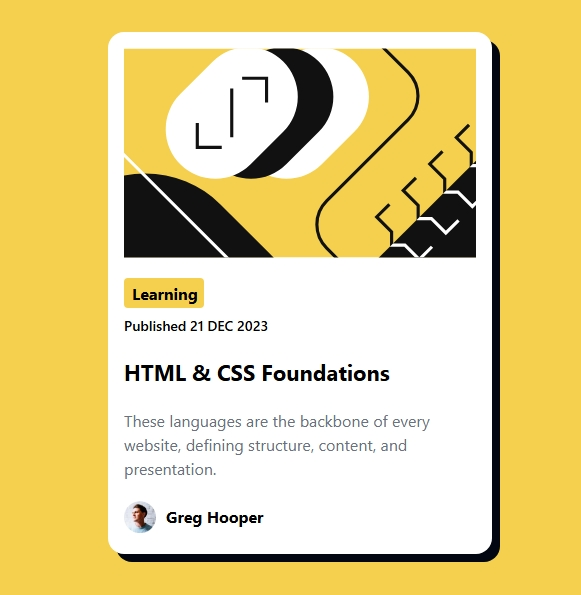

# 📰 Frontend Mentor – Blog Preview Card

A clean and elegant **Blog Preview Card** built with **React + Tailwind CSS**, designed to match the Frontend Mentor challenge with pixel-perfect precision and smooth hover transitions.

---

## 🌐 Overview

This project is my solution for **Frontend Mentor Challenge #2 – Blog Preview Card**.  
The objective was to recreate a modern, minimal blog preview layout that’s both **responsive** and **interactive**, staying faithful to the original design.

The final result is a lightweight and visually balanced card that subtly reacts to hover, highlighting the importance of micro-interactions in modern UI design.

---

## 🖼️ Preview

Here’s how the final component looks 👇

---

## ⚙️ Built With

- ⚛️ **React** – Component-based structure for clean and reusable UI
- 🎨 **Tailwind CSS** – Utility-first styling for precision and speed
- ⚡ **Vite** – Super-fast build tool and local development environment

---

## ✨ Features

- Responsive **blog card** layout for all screen sizes
- Elegant **hover state** that lifts and brightens the card
- **Custom shadows** and transitions for visual depth
- Styled entirely using Tailwind utility classes
- Smooth and lightweight performance

---

## 🧠 Learnings

- Strengthened understanding of **component-driven development** in React
- Learned to apply **hover, transition, and shadow utilities** effectively in Tailwind
- Improved **attention to design accuracy** and pixel perfection
- Practiced writing **semantic and clean JSX structure**
- Gained appreciation for **small animations** that enhance user experience
- Understood how to make **interactive components** without adding extra dependencies

---

## 🧩 Challenge

This project was built as part of the [**Frontend Mentor**](https://www.frontendmentor.io) platform challenges — a great resource to refine frontend development and design skills by building real-world UI components.

The challenge emphasized:

- Recreating layouts from Figma design files
- Practicing CSS precision and visual hierarchy
- Writing clean, maintainable code without tutorials

---

> 🧷 _“Good design is not about adding more — it’s about achieving more with less.”_
